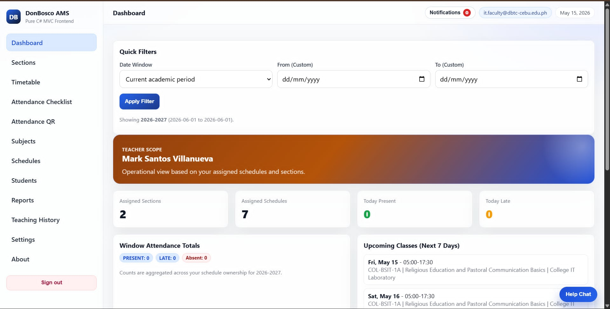
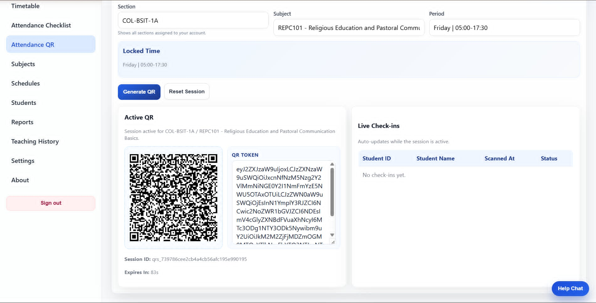
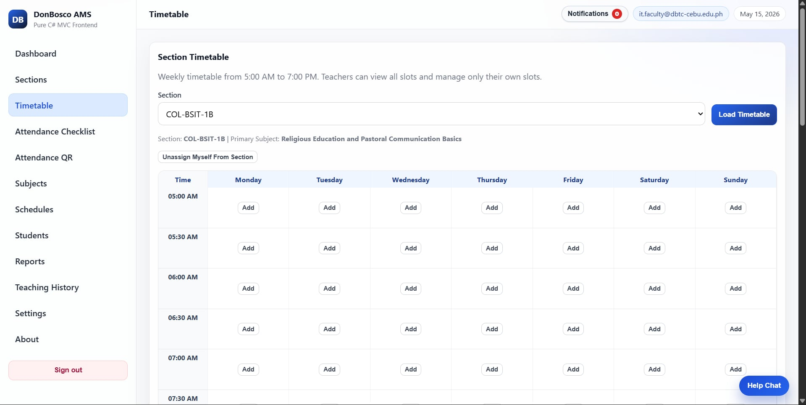

<div align="center">
  
  <br />
  <h1>🏫 Don Bosco Attendance Management System</h1>
  <p><em>A modern, efficient attendance platform built with ASP.NET Core MVC.</em></p>
  
  <p>
    <a href="https://dotnet.microsoft.com/"></a>
    <a href="https://www.postgresql.org/"></a>
    <a href="https://www.docker.com/"></a>
    
  </p>
</div>

<br />

## 📖 About The Project

The **Don Bosco Attendance Management System** is a pure ASP.NET MVC web application designed to streamline student attendance tracking. With server-rendered Razor views, SignalR notifications, and a PostgreSQL-backed domain model, the system delivers a secure, fast, and intuitive experience for administrators, teachers, and students.

### ✨ Key Features

- **🔐 Role-Based Access Control:** Distinct, secure navigation hubs for Admins, Teachers, and Students.
- **📱 QR Code Attendance:** Rapid and unforgeable attendance check-ins using dynamically signed QR codes.
- **🔔 Real-Time Notifications:** SignalR-powered updates plus SMTP support for alerts and password reset flows.
- **📊 Comprehensive Reports:** Visual insights into attendance trends and absentee warning levels.
- **🛡️ Secure Infrastructure:** Cookie-based ASP.NET Identity with secure hashing and data protection.

---

## 📸 Screenshots

<div align="center">
  
  &nbsp;
  
  &nbsp;
  
</div>

<br />

## 🛠️ Tech Stack

<div style="display: flex; gap: 10px; flex-wrap: wrap;">
  
  
  
  
  
</div>

---

## 📂 Repository Structure

- Main web app: [Attendance_Management_System/Attendance_Management_System](Attendance_Management_System/Attendance_Management_System)
- Solution file: [Attendance_Management_System/Attendance_Management_System.slnx](Attendance_Management_System/Attendance_Management_System.slnx)
- Backend domain/services/controllers: [Attendance_Management_System/Attendance_Management_System/Backend](Attendance_Management_System/Attendance_Management_System/Backend)
- Frontend Razor views and static assets: [Attendance_Management_System/Attendance_Management_System/Frontend](Attendance_Management_System/Attendance_Management_System/Frontend)
- Tests project: [Attendance_Management_System/tests/Attendance_Management_System.Tests](Attendance_Management_System/tests/Attendance_Management_System.Tests)

## Prerequisites

- .NET SDK 9.0+
- PostgreSQL running locally
- Git

## 🚀 Quick Start (Local)

1. Restore/build:

```powershell
dotnet build Attendance_Management_System/Attendance_Management_System.slnx
```

2. Ensure DB connection string is valid.

Default is in [Attendance_Management_System/Attendance_Management_System/appsettings.json](Attendance_Management_System/Attendance_Management_System/appsettings.json), but for local testing prefer runtime override:

```powershell
$env:ConnectionStrings__Default='Host=localhost;Port=5432;Database=attendance_db;Username=postgres;Password=YOUR_PASSWORD'
dotnet run --project Attendance_Management_System/Attendance_Management_System/Attendance_Management_System.csproj --launch-profile manual-qa
```

3. Open:

- Login: `http://localhost:5003/login`
- Signup: `http://localhost:5003/signup`
- Health: `http://localhost:5003/health`

## 🌱 Seeded Accounts (Fresh Database Only)

Seed runs only when there are no users yet.

- Admin:
  - Email: `admin@dbtc-cebu.edu.ph`
- Teacher (seeded set):
  - Example email: `it.faculty@dbtc-cebu.edu.ph`
- Student pattern:
  - Email: `student01@dbtc-cebu.edu.ph` (and more)

Default seed passwords are intended for local testing only. For production deployments, rotate or replace all seeded credentials immediately.

Seed implementation is in [Attendance_Management_System/Attendance_Management_System/Backend/Data/SeedData.cs](Attendance_Management_System/Attendance_Management_System/Backend/Data/SeedData.cs).

## 🚢 Production Deployment

See [DEPLOY_SUPABASE_RENDER.md](DEPLOY_SUPABASE_RENDER.md) for the end-to-end Render + Supabase flow.

Environment variables (set in Render or your container runtime):

| Variable | Purpose |
| --- | --- |
| `ASPNETCORE_ENVIRONMENT` | Set to `Production` in hosted environments. |
| `ConnectionStrings__Default` | PostgreSQL connection string (Supabase or managed Postgres). |
| `EmailSettings__PublicBaseUrl` | Public HTTPS base URL used in email links. |
| `EmailSettings__Username` | Required in production. SMTP username. For Gmail, use the sending Gmail address. |
| `EmailSettings__Password` | Required in production. SMTP password. For Gmail, use a 16-character app password without spaces. |
| `EmailSettings__Host` | Optional SMTP host. Defaults to `smtp.gmail.com`. |
| `EmailSettings__Port` | Optional SMTP port. Defaults to `587`. |
| `EmailSettings__FromAddress` | Optional from address. Defaults to `EmailSettings__Username`. |
| `EmailSettings__FromName` | Optional from display name. Defaults to `Don Bosco Attendance`. |
| `EmailSettings__UseSsl` | Optional SMTP SSL toggle. Defaults to `false` for Gmail port 587 STARTTLS. |
| `AttendanceQrSettings__SigningKey` | Secret key for QR signing. |
| `CookieSettings__SecurePolicy` | Set to `Always` for production cookies. |
| `Logging__LogLevel__Default` | Default log level (recommended `Warning` for production). |
| `DataProtection__KeyPath` | Optional key storage path for cookie encryption keys. |

## 🧪 Testing

Build:

```powershell
dotnet build Attendance_Management_System/Attendance_Management_System.slnx -v minimal
```

Run tests:

```powershell
dotnet test Attendance_Management_System/tests/Attendance_Management_System.Tests/Attendance_Management_System.Tests.csproj -v minimal
```

## 🔍 Manual QA Notes

- For QR flows, test both routes:
  - Student scan page: `/attendance/scan`
  - Teacher/admin QR page: `/attendance/qr`
- If browser shows `chrome-error://chromewebdata`, open a new tab and load `http://localhost:5003/login` directly.
- Keep the app run terminal active while testing.

## 🌿 Branch and PR Workflow

- Work on feature branch (for this repo, often `JP`).
- Push branch updates to origin.
- Create PR into `main`.

If direct push to `main` is blocked, follow PR-only policy and use GitHub compare/PR flow.
